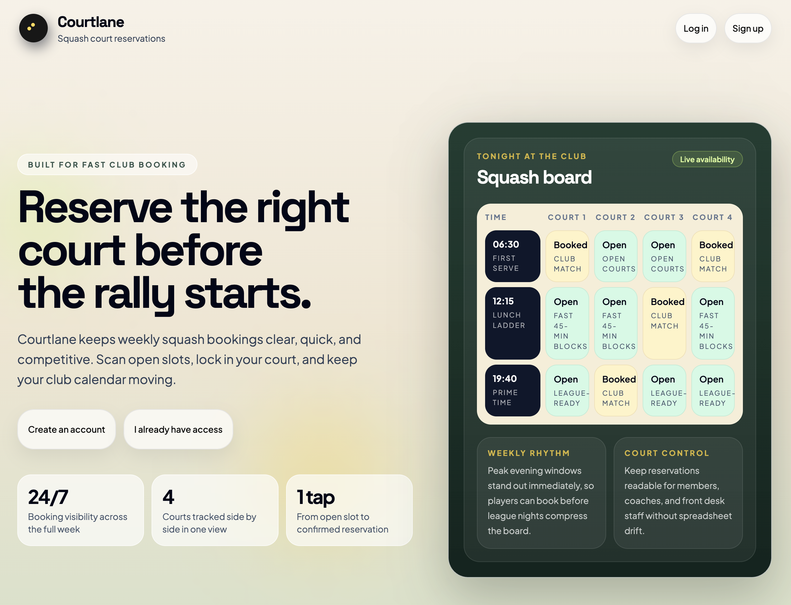

# Courtlane

Courtlane is a court reservation app for account-based sports venues. It lets staff manage weekly court availability, assign reservations to customers, and maintain a customer directory from a single account workspace.



## What The App Does

- Shows a weekly court schedule for an account.
- Lets staff assign, update, and clear reservations directly in the schedule.
- Keeps a shared customer directory for each account.
- Supports signup, login, session-based auth, and account-scoped data.

## Main Areas

- `apps/web`: React frontend for public auth flows and the authenticated account area.
- `apps/api`: NestJS backend for auth, customers, reservations, and health checks.
- `libs/contracts`: shared Zod schemas and TypeScript types used by both web and API.
- `libs/db`: Prisma schema, DB client setup, seed script, and DB-facing utilities.

## Local Development

### Prerequisites

- Node.js
- Yarn
- PostgreSQL

### Common Commands

```bash
yarn install
yarn db:prepare
yarn db:seed
yarn web:start
yarn api:start
```

Useful workspace commands:

```bash
yarn web:build
yarn api:build
yarn test
yarn lint
yarn format
```

## Product Flow

1. A user signs up or logs in.
2. The authenticated account area loads the weekly reservation planner.
3. Staff can assign customers to open court slots or clear existing reservations.
4. Staff can create, edit, and delete customers from the customer directory.

## More Detail

- [Architecture README](docs/architecture/README.md)
- [API README](apps/api/README.md)
- [Database README](libs/db/README.md)

