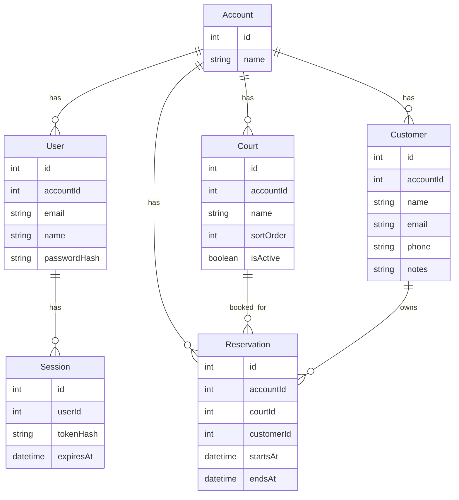

# Database

`libs/db` owns the Prisma schema, generated client wiring, and DB-level utilities used by the API.

## Purpose

- Define the PostgreSQL schema
- Configure the Prisma client
- Provide seed and migration support
- Keep persistence details out of the frontend and shared contracts

## Main Entities

- `Account`
- `User`
- `Session`
- `Court`
- `Customer`
- `Reservation`

## Relationship Diagram



## Important Rules

- Reservations are account-scoped.
- Courts are account-scoped.
- Customers are account-scoped.
- Reservations reference customers with `onDelete: Restrict`.

That last rule is why a customer cannot be deleted while reservations still point to it.

## Useful Commands

```bash
yarn db:prepare
yarn db:reset
yarn db:seed
```

